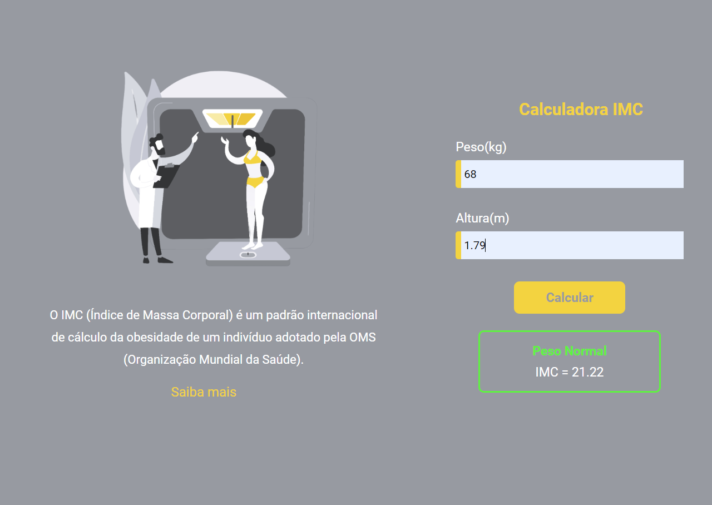
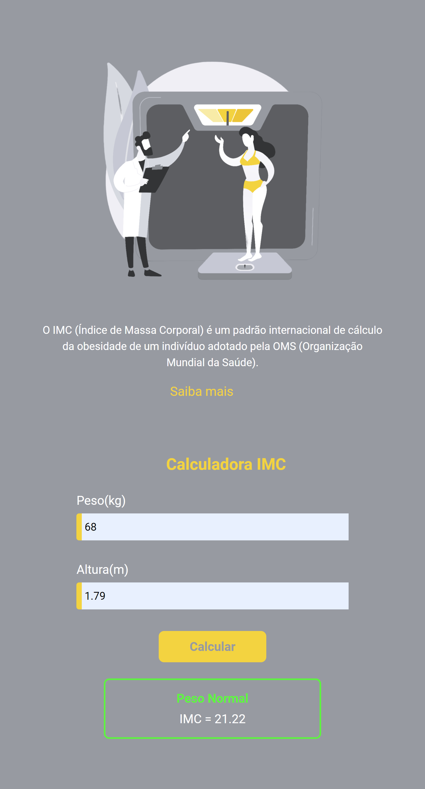
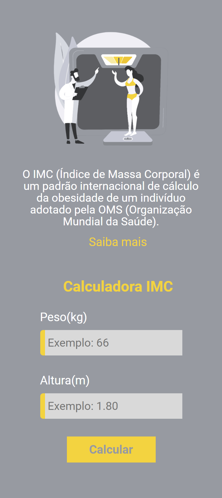

<h1 align="center">Calculadore de IMC</h1>

## Sobre 
O IMC índice de massa corporal é um cálculo universal adotado pela Organização mundial de Saúde que classifica padrões da saúde relacionados ao peso, como desnutrição e obesidade.
O resultado desse cálculo é gerado após realizar a divisão do peso do paciente pela altura multiplicado por ela mesma, ex: peso / (altura*altura).

<a href="" target="_blank" >Link Site 💻</a>

<h2>Layout 🖥️</h2>

## Tecnologias utilizadas 👨🏻‍💻
- HTML
- CSS
- JavaScript
